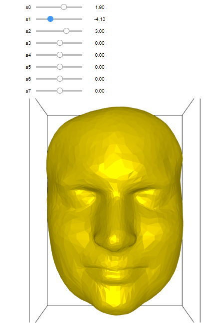

# Shape Modeling and Geometry Processing - Assignment 6 Group Project - Group 6

## Student data

Name: Haraldur Orri Hauksson  
Legi-Nr: 20-942-892  
Email: hhauksson@student.ethz.ch

Name: Michael Kürsteiner  
Legi-Nr: 16-708-414  
Email: kumichae@student.ethz.ch

Name: Pavel Pozdnyakov  
Legi-Nr: 11-557-048  
Email: popavel@student.ethz.ch

Name: Ana Zegarac  
Legi-Nr: 18-941-591  
Email: ana.zegarac@math.ethz.ch

Name: Christopher Vogelsanger  
Legi-Nr: 16-933-863  
Email: cvogelsa@student.ethz.ch

## Work division
- **Landmark selection**: Haraldur Orri Hauksson, Ana Zegarac
- **Smoothing for mesh boundaries**: Haraldur Orri Hauksson
- **Rigid face alignment**: Michael Kürsteiner
- **Non-rigid face alignment**: Michael Kürsteiner, Haraldur Orri Hauksson, Pavel Pozdnyakov
- **PCA, UI**: Christopher Vogelsanger, Pavel Pozdnyakov, Ana Zegarac
- **Report, Presentation slides**: Ana Zegarac, Pavel Pozdnyakov
- **Bonus 2 (Autoencoder)**: Christopher Vogelsanger

## Presentation slides
https://docs.google.com/presentation/d/1TO7acJaVpoU-tNrBaVQhV4lMdOnlyNggBV0Yxc8fQ5o/edit?usp=sharing  

## Report

Since the project has three distinct parts, we organised the codebase in three branches:
- landmark;
- non-rigid-alignment; and
- pca.

We describe our approach to each of these three parts below and link the outputs.

### Landmarks

The UI for creating landmarks looks as follows.

Core features are:
- Select landmarks and save them into .landmark files;
- If the user makes a mistake when creating landmarks, possibility to remove the last created landmark (or all of the created landmarks at once);
- Iteratively load (and process) meshes from the `data` folder;
- Smooth out the given mesh outside of the selected area.

Since alignment worked okay on the original meshes, we did not end up using the smoothing function.

#### Landmarks output

We created landmark files for 112 meshes from `scanned_faces_cleaned`. Each landmark file consists of 23 landmarks distributed as is shown in the screenshot below.

The landmark files can be found at https://polybox.ethz.ch/index.php/s/CSzukEdXSbtsdjh

#### Additional screenshots

##### Landmark creation

##### Smoothing out the meshes

### Alignment

The non-rigid-alignment code starts by loading a predetermined mesh. The user can then:
1. Perform rigid alignment by pressing `1`;
2. Perform non-rigid-alignment once by pressing `2` (each time an additional landmark is added into boundary conditions);
3. Perform smoothing by pressing `3`;
4. Save the aligned mesh;
5. Run steps 1, 2 and 4 for all the meshes in the folder `data`, with step 2 being executed until the mesh converges.

#### Alignment output

The aligned meshes can be found at https://polybox.ethz.ch/index.php/s/tDdk5dlYEw657HD

#### Video and screenshots
Non-rigid alignment is demonstrated in the video below:
https://youtu.be/sTtTwpT7WTU  

Alignment UI can be seen below.

Rigid alignment

Non-rigid alignment (1st iteration)

Non-rigid alignment (after a couple iterations)

Non-rigid alignment (converged)

Non-rigid smoothed (converged)

  

#### Additional remarks

We had issues running our code on meshes `alex wacky.obj` and `nick smile.obj`. We suspect these issues arose due to the fact that the number of connected components in these two meshes is greater than 1.

### PCA

The pca code runs PCA on all meshes in the folder `data` and allows the user to fine-tune 8 eigenfaces though the UI displayed below.

To perform morphing from e.g. a face with a neutral facial expression to a face with a smile, the user can simply insert the two corresponding aligned .obj files into `data` and change eigenvalues accordingly. The next three screenshots showcase this progression from 'neutral' to 'smile'.

Otherwise, by running the code on all available meshes, the user can analyse the most prominent features in the given set of meshes and create new meshes. The UI also allows the user to save the newly created meshes.  

### Small Isolated Components  

Two of the provided scanned and cleaned faces (alex wacky & nick smile) had a very small isolated component on top that would make the system we build for the non-rigid alignment unsolvable and the program would crash. Hence, we removed those isolated components in MeshLab and then ran the non-rigid alignment on the new meshes. The alex wacky mesh can now be non-rigidly aligned. However, the nick smile mesh crashes during the building process of its octree in the igl::octree call because of a stack overflow. Unfortunately, we ran out of time and were not able to find the cause of the problem.  

Download link to the scanned faces without these isolated components and the non-rigidly aligned alex wacky mesh:  
https://polybox.ethz.ch/index.php/s/cjRhESLI9sI38pl  

Below are the meshes with the isolated components loaded in MeshLab:  

  
  

### Autoencoder

The autoencoder code runs a simple fully connected autoencoder on all meshes in the folder `data`. A seperate viewer allows the user to look at reconstructions and change the latent space.

Reconstruction of a high resulution mesh:

Latent space impact:

Latent space impact:

Latent space impact:

The high number of verticies makes the compression rather steep and thus the reconstructed faces look all very similar. On the lower resolution data from the past years the approach works definitively better.

Reconstruction of a low resulution mesh:

Latent space impact:

Latent space impact:

